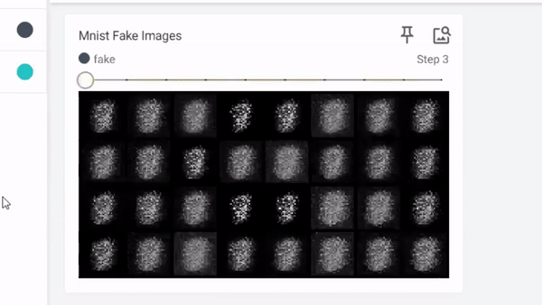

# Generative Adversarial Network (GAN) for Image Generation

## Overview

Welcome to the project! This GAN implementation is designed to generate realistic images of digits using a generative and discriminative neural network architecture.

## Training Approach

### High-Level Overview

The training approach involves a dynamic interplay between the generator and discriminator networks. The generator aims to create realistic images, while the discriminator learns to distinguish between real and generated images. The adversarial nature of GANs fosters a continual learning process, where both networks strive to improve their performance.

### Batch Training Importance

In GANs, batch training plays a crucial role in enhancing the stability and convergence of the model. Instead of updating the model parameters after processing each individual data point, batch training involves processing and updating the parameters based on a batch of data points. This approach helps to smooth out fluctuations in the loss landscape, leading to more stable and robust training.

Batch training in GANs is particularly important for the following reasons:

- **Gradient Stability:** GANs are notorious for training instability. Batch training helps in stabilizing the gradient updates during the training process, making it less susceptible to mode collapse or oscillations.

- **Improved Convergence:** By updating model parameters based on a batch of samples, the model tends to converge more smoothly, mitigating issues such as mode dropping and generator collapse.

- **Computational Efficiency:** Batch training allows for parallelization of operations, leading to improved computational efficiency and faster convergence.

